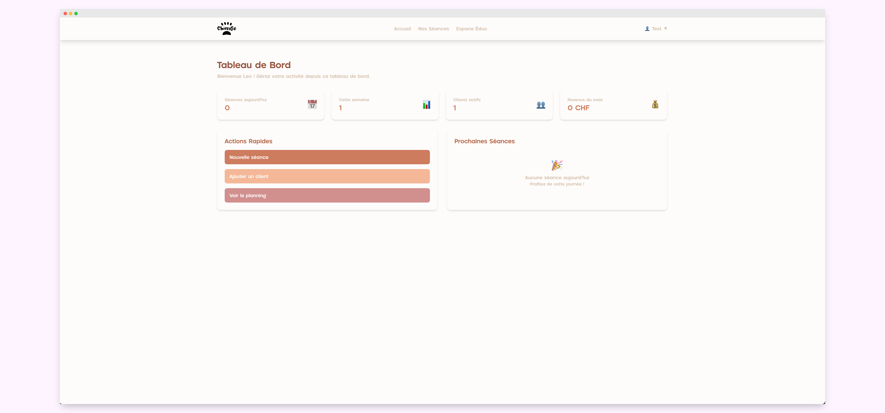

# ChienGo - Plateforme Educ canin

<div align="center">
  
  
  <p>
    <strong>CMS professionnel pour éducateurs canins</strong><br>
    Organisez, planifiez et gérez vos séances d'éducation canine en toute simplicité
  </p>

  
  
  
  
  
</div>

---

## Aperçu

ChienGo est un système de gestion de contenu (CMS) développé spécifiquement pour les éducateurs canins professionnels. Il permet de gérer efficacement les clients, leurs compagnons à quatre pattes et l'organisation des séances d'éducation.

---

## Sommaire

- [Fonctionnalités principales](#fonctionnalités-principales)
- [Technologies utilisées](#technologies-utilisées)
- [Installation rapide](#installation-rapide)
- [Utilisation](#utilisation)
- [Structure du projet](#structure-du-projet)
- [Capture d’écran](#capture-décran)
- [Contribution](#contribution)
- [Licence](#licence)


### Fonctionnalités principales

**Authentification sécurisée** : Système de connexion avec hash des mots de passe<br>
**Gestion des clients** : CRUD complet avec informations détaillées<br>
**Profils des chiens** : CRUD complet en backend - suivi personnalisé (race, âge, caractère, problèmes comportementaux)<br>
**Planning des séances** : CRUD complet - organisation et suivi des séances d'éducation<br>
**Gestion financière** : Suivi des revenus et tarification<br>
**Tableau de bord** : Statistiques et aperçu de l'activité<br>
**Interface responsive** : Mobile, tablet, desktop<br>
**Pages publiques** : Accueil, Nos séances, Page 404 personnalisée<br>
**Interface Administration** : Vue générale des éducateurs, configuration types/prix/durées/couleurs, création de nouveaux types, accès au dashboard éducateur


---

## Technologies utilisées

### Backend
**PHP 8+** : Programmation orientée objet (POO)<br>
**MySQL** : Base de données relationnelle<br>
**PDO** : Accès sécurisé aux données<br>
**Architecture MVC** : Séparation des responsabilités<br>
**Autoloader PSR-4** : Chargement automatique des classes<br>
**Namespaces** : Organisation modulaire du code<br>

### Frontend
**Tailwind CSS** : Framework CSS utilitaire<br>
**JavaScript vanilla** - Interactions dynamiques<br>
**Polices personnalisées** - Wash Your Hand & Pogonia<br>

### Sécurité
Protection contre les injections SQL<br>
Protection CSRF (Cross-Site Request Forgery)<br>
Protection XSS (Cross-Site Scripting)<br>
Hash sécurisé des mots de passe<br>
Validation serveur des formulaires<br>
Sessions sécurisées

---

## Installation rapide

### Prérequis
```bash
PHP 8.0+  |  MySQL 5.7+  |  Composer  |  Serveur web ou PHP intégré
```

### En 4 étapes pour démarrer

1. **Cloner & configurer**
   ```bash
   git clone https://github.com/ilumaty/chiengo.git
   cd chiengo
   ```

2. **Installer l'autoloader**
   ```bash
   composer install
   ```

3. **Base de données**
   ```bash
   # Créer la base MySQL
   mysql -u root -p
   CREATE DATABASE chiengo_db CHARACTER SET utf8mb4;
   
   # Importer le schéma
   mysql -u root -p chiengo_db < app/config/database.sql
   ```

4. **Lancer l'application**
   ```bash
   cd public
   php -S localhost:8000
   ```

**Accès : [http://localhost:8000](http://localhost:8000)**

### Comptes de test
| Rôle          | Email               | Mot de passe  |
|---------------|---------------------|---------------|
| **Éducateur** | `test@chiengo.com`  | `password123` |
| **Admin**     | `admin@chiengo.com` | `password123` |

---

## Utilisation

### Première connexion
**Email**: `test@chiengo.com`<br>
**Mot de passe**: `password123`

### Navigation principale
**Dashboard** : Vue d'ensemble de votre activité<br>
**Clients** : Gestion de votre portefeuille client<br>
**Séances** : Planning et organisation des cours<br>
**Administration** : Gestion des utilisateurs et types de séances (admin uniquement)<br>

---

## Structure du projet

```
chiengo/
├── app/                   # Application principale
│   ├── config/            # Configuration BDD
│   ├── controllers/       # Logique métier
│   ├── models/            # Entités et données
│   └── views/             # Interface utilisateur
├── public/                # Point d'entrée
│   ├── assets/            # Ressources statiques
│   │   ├── css/           # Styles personnalisés
│   │   ├── fonts/         # Polices utilisées
│   │   ├── icons/         # Icônes (SVG, etc.)
│   │   ├── img/           # Images du site
│   │   ├── js/            # Scripts JavaScript
│   │   └── logo/          # Logos du projet
│   ├── index.php          # Routeur principal
│   └── diagno.php         # Fichier de diagnostic
├── vendor/                # Autoloader Composer PSR-4
├── composer.json          # Configuration des namespaces
├── LICENSE.md             # Licence du projet
└── README.md              # Documentation du projet
```

---

## Capture d'écran

<div align="center">
  
  <p><em>Dashboard principal avec statistiques en temps réel</em></p>
</div>

---

## Scripts utiles

| Commande                 | Description            |
|--------------------------|------------------------|
| `php -S localhost:8000`  | Lance le serveur local |
| `php public/diagno.php`  | Tests de configuration |
| `composer dump-autoload` | Régénère l'autoloader  |

---

## Contribution

Les contributions sont les bienvenues ! Voici comment vous pouvez aider :

1. **Fork** le projet
2. **Créez** votre branche (`git checkout -b feature/AmazingFeature`)
3. **Commitez** vos changements (`git commit -m 'Add: AmazingFeature'`)
4. **Push** vers la branche (`git push origin feature/AmazingFeature`)
5. **Ouvrez** une Pull Request

### Standards de développement
- Code PHP conforme aux standards PSR
- Noms de variables explicites en français
- Commentaires pour les fonctions complexes
- Tests des fonctionnalités avant commit

---

<br>
<div align="center">
  <p>
    <strong>Fait avec ❤️ pour la communauté des éducateurs canins</strong><br>
    <em>Projet d'examen - School développement web</em>
  </p>
  
  ⭐ **N'hésitez pas à donner une étoile si ce projet vous plaît !**
[](https://github.com/ilumaty/chiengo/stargazers)
</div>

---

## Licence

Ce projet est sous licence MIT. Voir le fichier [LICENSE](LICENSE.md) pour plus de détails.

⚠️ Les images et éléments graphiques inclus dans ce projet sont protégés par le droit d’auteur et ne sont pas couverts par la licence MIT. Toute utilisation sans autorisation est interdite.

---

Pour toute question : maxstudy66@gmail.com

© 2025 Max. All rights reserved.
